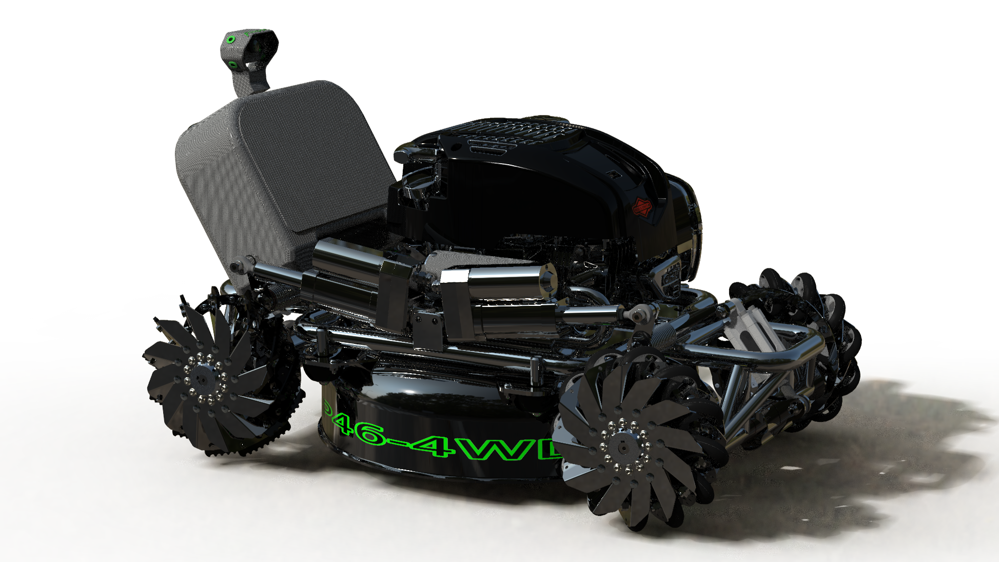
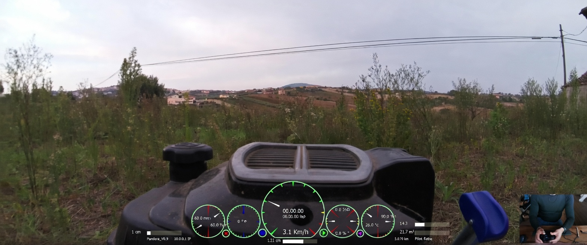
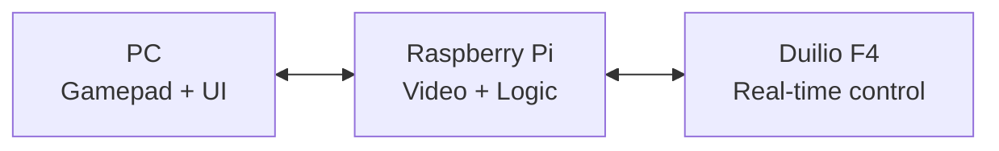

  

# DUILIO FPV - Limitless Remote Control

  

## Real-time remote control. No distance limits.

Duilio FPV enables real-time remote control of vehicles and machines from anywhere using Wi-Fi mesh and 4G/5G networks.

Built to remove physical barriers, Duilio FPV brings real-world actions into the digital space with a game-like operator experience.

  

Real-world operation: Duilio FPV at work in the field.

## At a Glance

| Topic | Summary |
|---|---|
| Latency | Real-time remote control designed for ultra-low delay operation |
| Connectivity | Wi-Fi mesh and 4G/5G network support |
| Control | PC operator station with live first-person visual feedback |
| Safety | Failsafe-first architecture and supervised operation |
| Telemetry | Monitoring and diagnostics-ready workflow |
| Architecture | Distributed system (PC + Raspberry Pi + STM32 real-time control) |

## Highlights

- Unlimited range remote control over Wi-Fi and 4G/5G
- Ultra-low latency real-time operation
- Hardware-agnostic design
- Distributed architecture (PC + Raspberry Pi + STM32)
- Built-in safety and failsafe logic
- Optimized integration with Duilio F4 hardware

## How the System Works

As with a videogame, the operator controls the vehicle from a PC with a gamepad while viewing the onboard camera feed in first person.

Core flow:

1. Low-latency connection
   Commands and video are exchanged over Wi-Fi or 4G/5G networks.
2. Remote control station (PC)
   The operator sends commands and receives live video/audio feedback.
3. Onboard processing (Raspberry Pi)
   Handles communication, video streaming, and high-level logic.
4. Real-time control (Duilio F4)
   Executes precise motor control and safety-critical functions.

## Duilio F4 - Advanced Features

- Dedicated STM32 real-time control for precise and reliable actuation
- Scalable multi-node system using robust RS-485 bus for motors and peripherals
- Multi-mode motor control:
  speed control (DC motors) and position control (servo/actuator)
- Advanced safety system:
  multi-layer failsafe, fail-off logic, watchdog monitoring, and safe state fallback
- Local RC control with priority override over remote commands
- Relay outputs for external device control:
  lights, thermal engine ignition, horn, and auxiliary systems
- Integrated telemetry system with real-time data:
  battery voltage, speed, temperature, obstacle distance, signal quality, and latency
- GPS support:
  live map visualization and real-time position tracking
- IMU integration with feedback, including vibration on the gamepad
- Assisted driving features:
  straight-line stabilization and basic autopilot support
- Advanced remote interface:
  live gauges, messages, and diagnostics
- Media control:
  high-resolution photo capture and dynamic video resolution control
- Full system monitoring:
  trip data, system status, and diagnostics
- Remote logging and diagnostics support

## Ecosystem Repositories

### Onboard

Machine-side software, typically running on Raspberry Pi-class hardware.

- Repository: [duilio_fpv_onboard](https://github.com/giuliodori/duilio_fpv_onboard)
- Scope: communication, control, sensors, low-level logic, hardware integration

### Offboard

Operator-side software, typically running on a PC.

- Repository: [duilio_fpv_offboard](https://github.com/giuliodori/duilio_fpv_offboard)
- Scope: user interface, remote control, telemetry visualization, operator workflow

### Hardware

Reference hardware platform optimized for the ecosystem.

- Repository: [duilio_f4](https://github.com/Giuliodori/duilio_f4)
- Scope: tested electronics base for tighter integration and higher reliability

## Why Duilio FPV

Unlike traditional RC systems, Duilio FPV is designed as a real distributed control platform:

- No distance limits
- Network-based control instead of proprietary RF
- Scalable multi-node architecture
- Support for both hobby and industrial systems
- Built for real-world applications, not just prototyping

## Project Goal

Duilio FPV was born from a real need: enabling a person with a physical disability to mow the lawn remotely.

The vision is to remove physical barriers and bring real-world actions into the digital space, allowing anyone to operate machines, explore environments, and perform tasks from anywhere.

From this starting point, the project expands toward robotics, remote vehicles, and distributed automation systems.

## Repository Scope

This repository is the main Duilio FPV hub and project presentation. Most implementation code lives in the dedicated repositories above.

Choose your entry point:

1. Start from `offboard` if you want to see the operator experience and interface layer.
2. Start from `onboard` if you want to inspect machine-side logic and hardware interaction.
3. Start from `duilio_f4` if you want the reference electronics platform.

## Status

Active development - core architecture is functional and continuously evolving.

Current focus:

- reliability and failsafe validation
- telemetry quality and diagnostics
- deployment hardening for real-world operation

## Contributing

Contribution guidelines are in [CONTRIBUTING.md](CONTRIBUTING.md).

In short:

- use this repository for hub-level issues and documentation updates
- open code-specific issues and pull requests in the relevant subproject repository

## Author

Fabio Giuliodori
Founder and Creator, Duilio FPV

- Website: https://duilio.cc
- LinkedIn: https://linkedin.com/in/fabio-giuliodori
- Email: info@duilio.cc

## License

This repository is distributed under the GPL-3.0 license. See [LICENSE](LICENSE).
